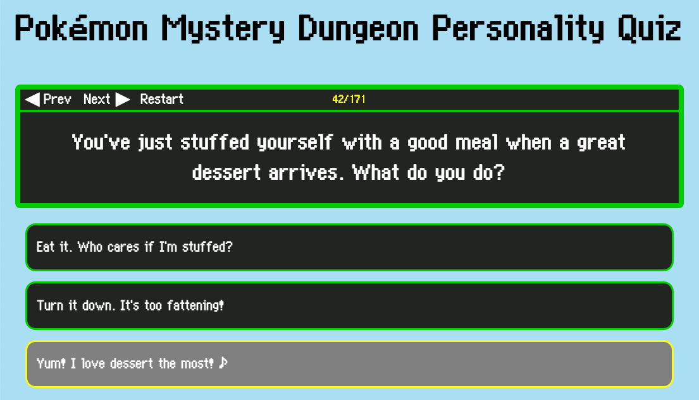

# Pokémon Mystery Dungeon Personality Quiz

A website where you can take Pokémon Mystery Dungeon personality quizzes. Questions come from Red/Blue Rescue Team, Explorers of Time/Darkness, and Explorers of Sky.

Currently not hosted anywhere.

# At a Glance
### Complete the light-hearted personality quiz from Pokémon Mystery Dungeon!

### Which Pokémon are you?

# Some Notes
These are some highlighted details on how the quiz works. The full details are listed in the [Details](details/index.html) page.

## Questions
* Quiz questions are randomly selected and ordered from the selected pool of questions.
* If the selected pool of questions draws on multiple games, repeat questions are excluded.

## Scoring
* Scoring is done using the lower bound on a 95% Wilson binomial confidence interval (like [Reddit comment Best sorting](https://redditblog.com/2009/10/15/reddits-new-comment-sorting-system/)), based (for each nature) on the ratio between the number of points the user scored and the maximum number of points the user hypothetically could have scored.
* Scoring is done over all the quiz questions, as well as over subsets of the quiz questions that come from each game.
* Personality points from *Explorers* are halved to line up better with *Rescue Team* in magnitude.

## Results and Starter Assignment
* The assigned nature is the one with the highest score (over all questions). Ties are broken randomly.
* The user is also "assigned a game" internally. The subscores over the different games' questions are evaluated for the assigned nature, and the game with the highest subscore is chosen. Ties are broken randomly.
* The nature description at the end is taken from the assigned game.
* The starter of the appropriate nature and gender is chosen from the assigned game.
* Selecting "neither" for gender results in a gender being randomly chosen for the sake of assigning a starter.
* The "Other starters" result appears if different starters would have been chosen using different available games/genders.
  * Available genders are either male, female, or both in the case of a "Neither" user response.
  * Available games are based on the sources of the question pool selected at the beginning of the quiz.
